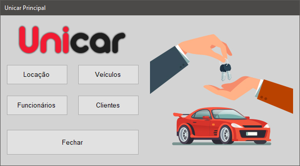

<h1 align="center">
    
    <br>
</h1>

<p align="center">
  
  
  
  
  
  
  
  
  
</p>

<h4 align="center">
  <p>Programa feito em grupo para o projeto prático na faculdade</p>
  <p>Está funcional mas ainda não está completo, porque cada membro desenvolveu uma parte.</p>
  <p>O código que está nesse repositório é somente a minha parte.</p>
</h4>


<p align="center">
  |&nbsp;&nbsp;&nbsp;
  <a href="#tecnologias">Tecnologias</a>&nbsp;&nbsp;&nbsp;|&nbsp;&nbsp;&nbsp;
  <a href="#como-usar">Como Usar</a>&nbsp;&nbsp;&nbsp;|&nbsp;&nbsp;&nbsp;
  <a href="#licença">Licença</a>
  &nbsp;&nbsp;&nbsp;|
</p>

<p align="center">
  
</p>

## Tecnologias

Projeto desenvolvido com as seguintes tecnologias:

- [C#][csharp]
- [SQL][sql]

## Como usar

Para clonar e executar o programa, você vai precisar do [Git][git], [Visual Studio][vs] e [MySQL][mysql] instalado no seu computador.

No seu terminal:

```bash
# Clone esse repositório
$ git clone https://github.com/V1PERFX/unicar.git

# Entre no repositório
$ cd unicar

# Execute o unicar.sql no MySQL para criar a base de dados
# Abra o Unicar.sln
# Troque a strConexao nas classes CadastroFuncionario e CadastroCliente
```

## Licença

This project is under de MIT license. See the [LICENSE](https://github.com/V1PERFX/unicar/blob/master/LICENSE) for more information.

---
<h4 align="center">
  Feito com :heart: por <a href="https://www.linkedin.com/in/v1perfx/">V1PERFX</a> 
</h4>

[csharp]: https://docs.microsoft.com/pt-br/dotnet/csharp/
[sql]: https://pt.wikipedia.org/wiki/SQL
[mysql]: https://www.mysql.com/
[git]: https://git-scm.com/
[vs]: https://visualstudio.microsoft.com/pt-br/vs/